# PERENCANAAN DIAGRAM MVP - WEB POSYANDU

Dokumen ini berisi rancangan perancangan perangkat lunak menggunakan arsitektur **Boundary-Control-Entity (BCE)** untuk modul Minimum Viable Product (MVP) proyek Web Posyandu. 

Agar diagram kelas (Class Diagram) tidak terlalu padat dan tulisan di dalamnya tetap terbaca dengan jelas saat dimasukkan ke dalam **Laporan PKL/Skripsi**, rancangan diagram kelas ini dibagi secara modular per modul fitur.

---

## 1. Lingkup Fitur MVP (Hasil Analisis Codebase)
Berdasarkan hasil pemindaian kode pada struktur Model, Controller, dan Routes, lingkup fitur MVP meliputi:
1. **Autentikasi & Manajemen Profil**: Proses masuk (login) dan pengelolaan data profil pengguna.
2. **Kelola Data Pengguna (Kader & Orang Tua)**: Administrasi akun Kader dan akun Orang Tua (Parent) oleh Admin.
3. **Kelola Data Sasaran (Balita, Ibu Hamil, Lansia)**: Manajemen pendaftaran dan pembaruan data balita, ibu hamil, dan lansia.
4. **Kelola Jadwal & Kehadiran (RSVP)**: Pembuatan jadwal kegiatan posyandu dan pengisian RSVP oleh orang tua.
5. **Pencatatan Layanan/Rekam Medis Bulanan**:
   - Pengukuran & Imunisasi Balita (`toddler_measurements`).
   - Rekam Medis Kehamilan Ibu Hamil (`pregnancy_records`).
   - Rekam Medis Pemeriksaan Lansia (`elderly_records`).

---

## 2. Perencanaan Class Diagram (Modular per Modul)

### A. Class Diagram Modul 1: Autentikasi & Profil Pengguna
Diagram ini memetakan kelas antarmuka login, manajemen profil, controller terkait, dan entitas user.

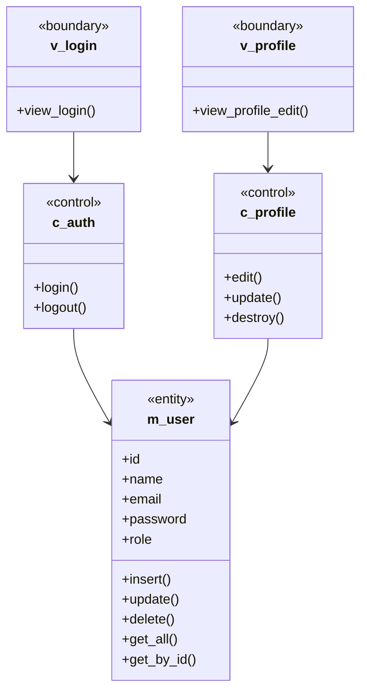

---

### B. Class Diagram Modul 2: Kelola Pengguna (Kader & Orang Tua)
Diagram ini memetakan kelola data akun petugas posyandu (Kader) dan akun Orang Tua (Parent) oleh Admin.

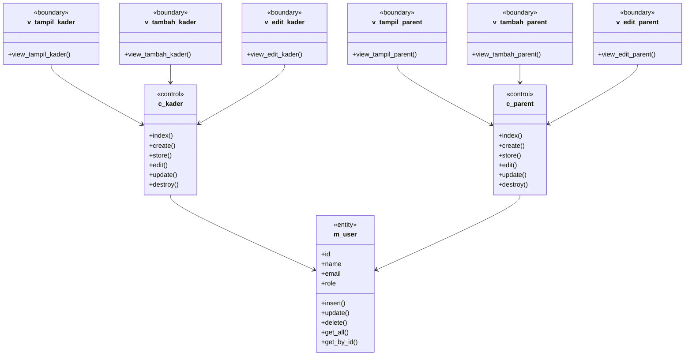

---

### C. Class Diagram Modul 3: Kelola Data Balita & Pencatatan Pengukuran
Diagram ini memetakan antarmuka pendaftaran balita, form rekam medis pengukuran/imunisasi, beserta controller dan model terkait.

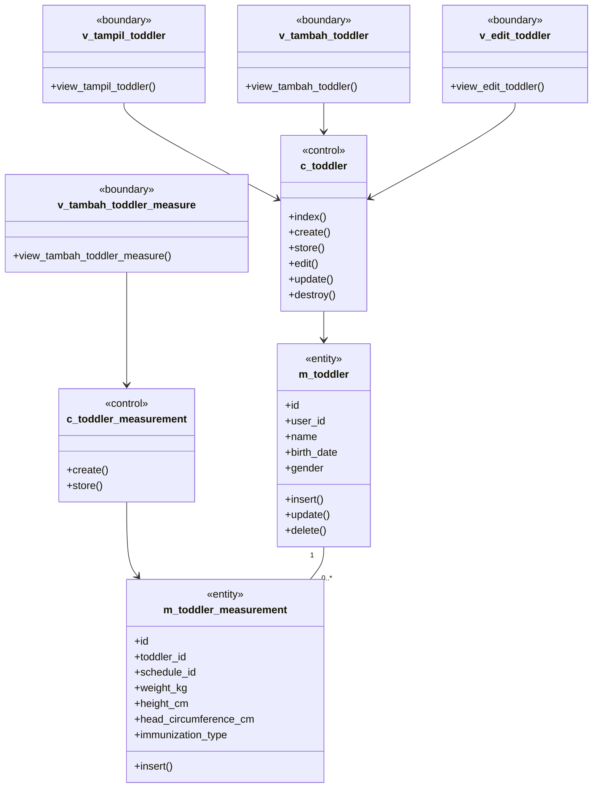

---

### D. Class Diagram Modul 4: Kelola Data Ibu Hamil & Rekam Medis Kehamilan
Diagram ini memetakan pengelolaan data ibu hamil beserta rekam medis kehamilan (tekanan darah, DJJ, dsb).

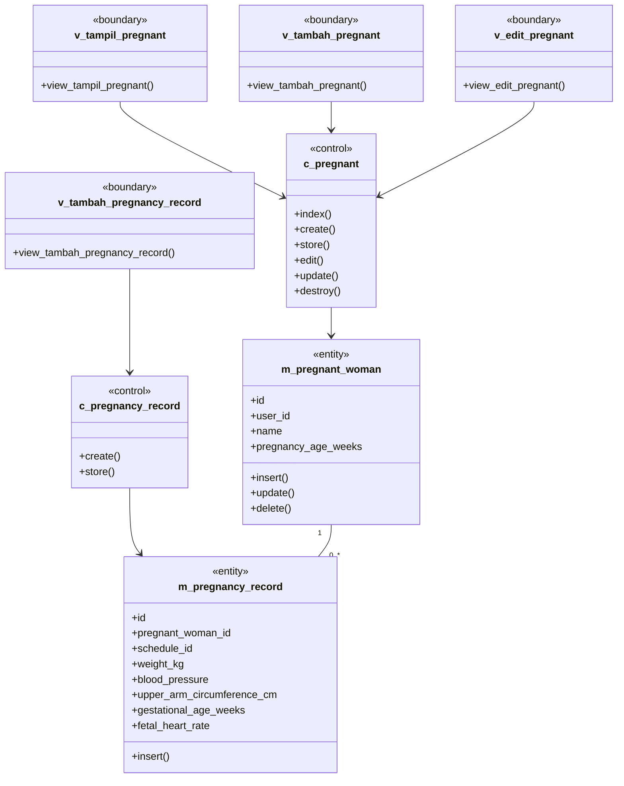

---

### E. Class Diagram Modul 5: Kelola Data Lansia & Rekam Medis Lansia
Diagram ini memetakan pengelolaan data pemeriksaan berkala untuk kelompok lanjut usia (Lansia).

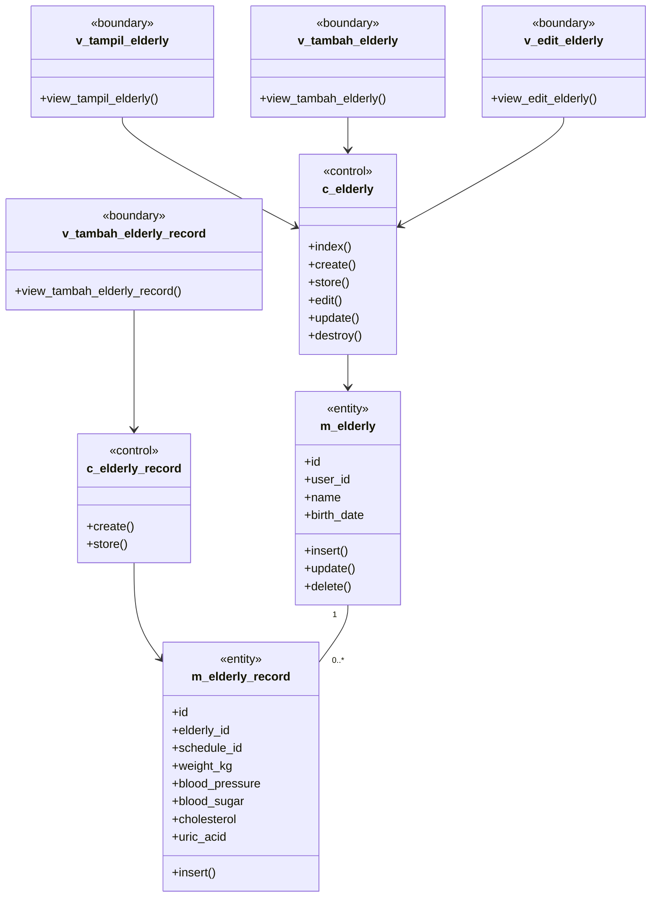

---

### F. Class Diagram Modul 6: Kelola Jadwal & Kehadiran (RSVP)
Diagram ini memetakan pembuatan jadwal posyandu serta pencatatan RSVP/kehadiran oleh orang tua.

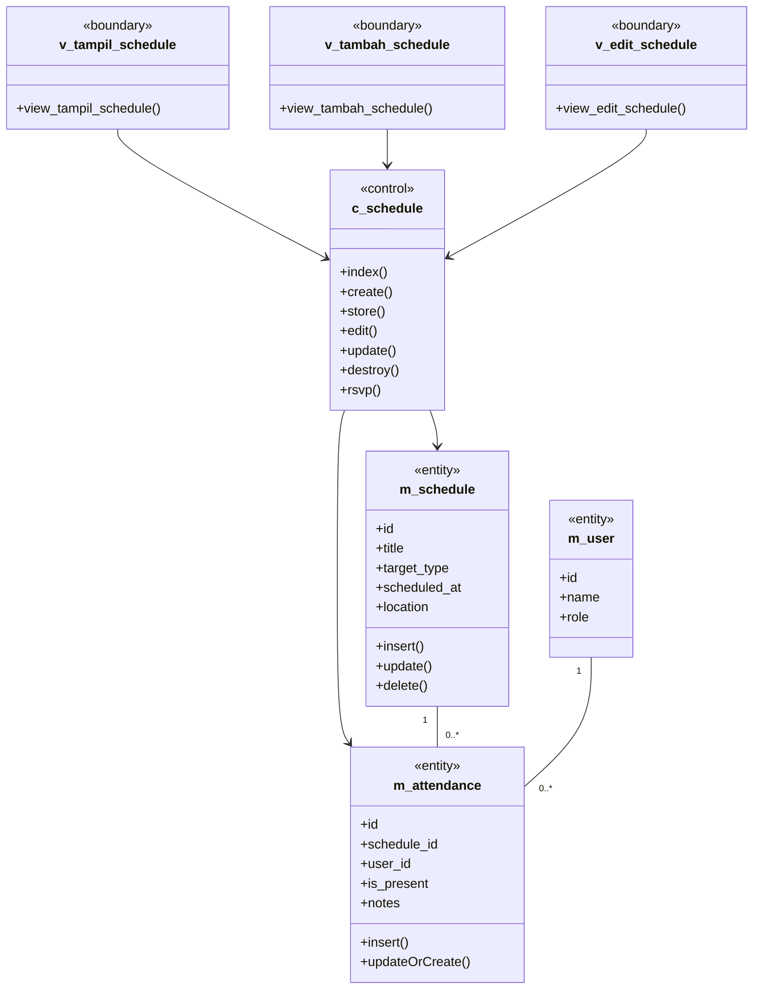

---

## 3. Perencanaan Sequence Diagram (BCE Pattern)

### A. Sequence Diagram Autentikasi: Login Pengguna
Menggambarkan alur masuk pengguna ke dalam sistem posyandu.

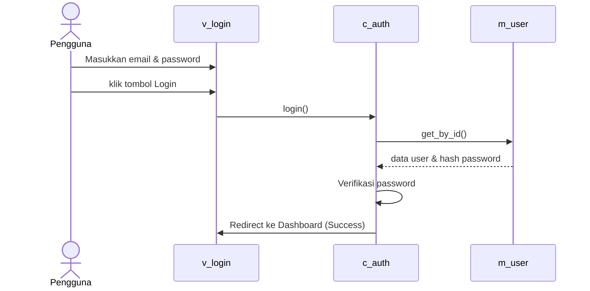

---

### B. Sequence Diagram Kelola Data Balita: Tambah Data Balita
Menggambarkan alur pendaftaran data balita oleh Kader atau Orang Tua.

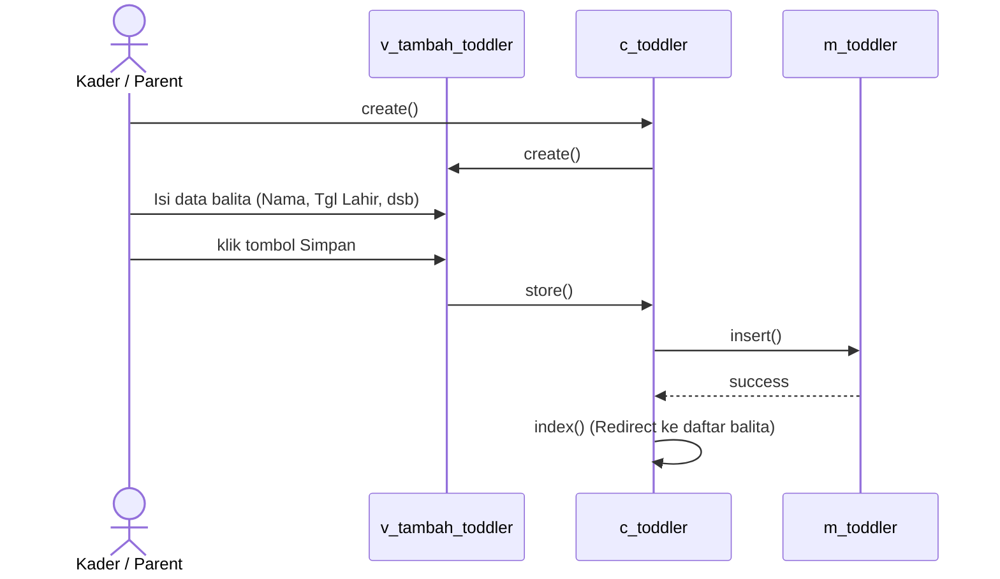

---

### C. Sequence Diagram Kelola Data Balita: Edit Data Balita
Menggambarkan alur pembaruan data balita yang sudah terdaftar.

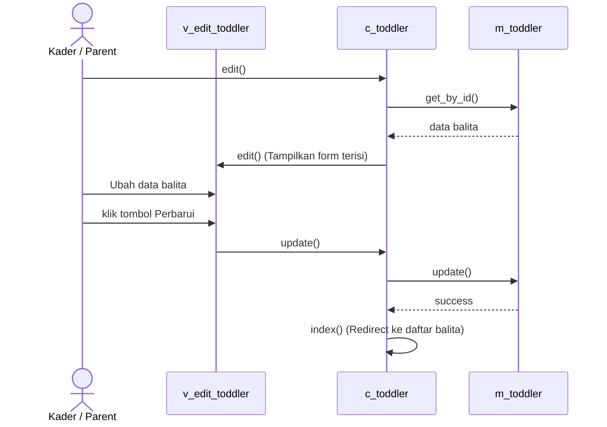

---

### D. Sequence Diagram Kelola Data Balita: Hapus Data Balita
Menggambarkan alur penghapusan data balita dari sistem.

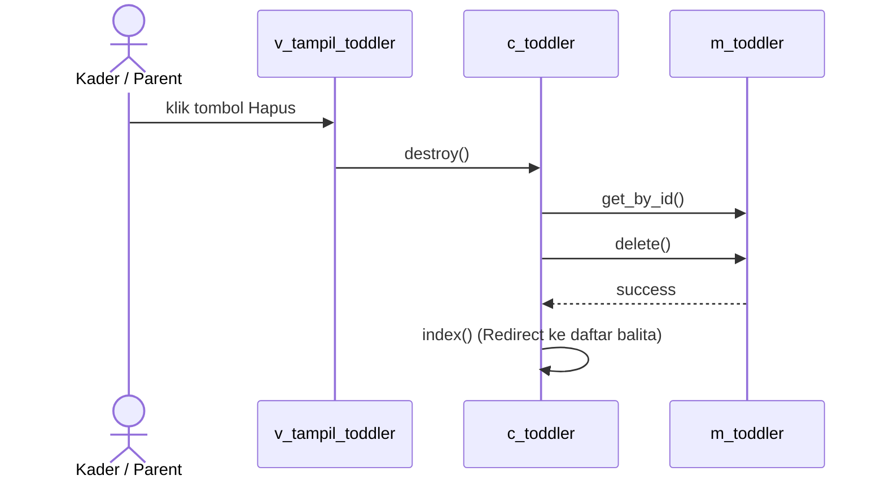

---

### E. Sequence Diagram Kelola Ibu Hamil: Tambah Data Ibu Hamil
Menggambarkan alur pendaftaran Ibu Hamil baru ke dalam sistem.

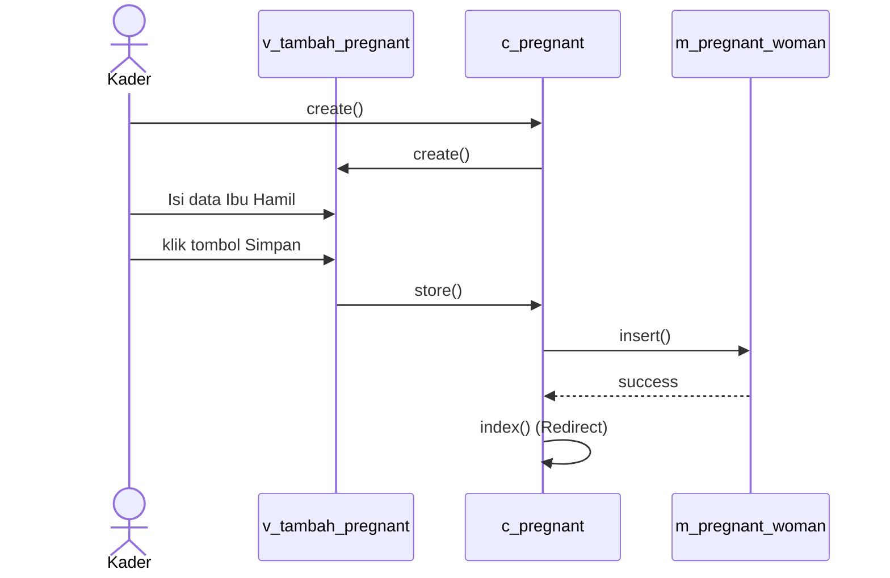

---

### F. Sequence Diagram Kelola Lansia: Tambah Data Lansia
Menggambarkan alur pendaftaran Lansia baru ke dalam sistem.

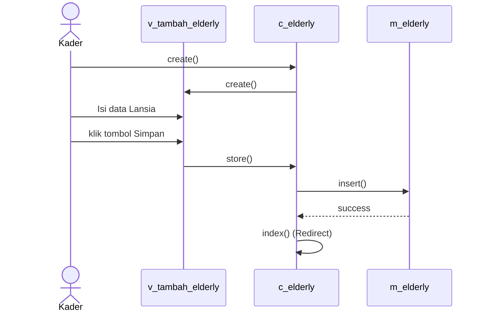

---

### G. Sequence Diagram RSVP Jadwal Posyandu
Menggambarkan alur Orang Tua melakukan RSVP kehadiran pada jadwal kegiatan.

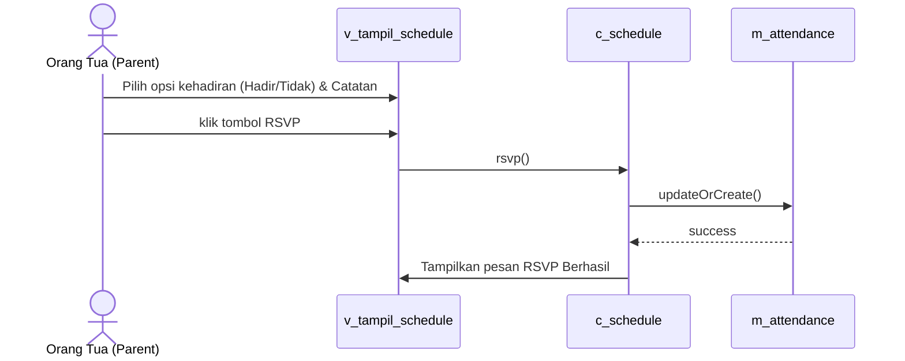

---

### H. Sequence Diagram Rekam Medis: Pencatatan Pengukuran & Imunisasi Balita
Menggambarkan alur pencatatan pengukuran fisik dan imunisasi balita saat kegiatan posyandu.

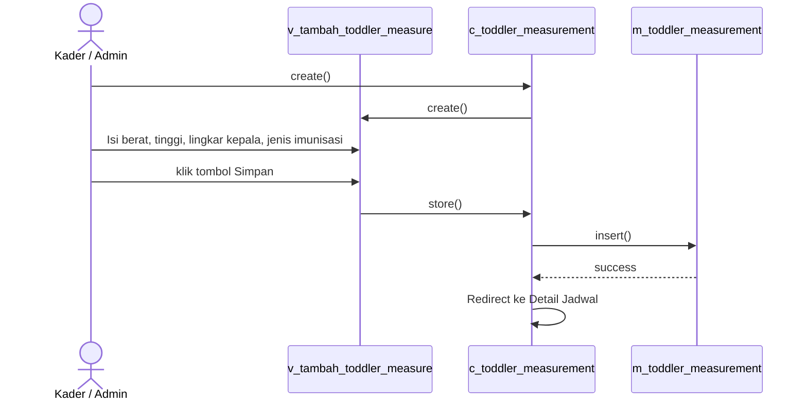

---

### I. Sequence Diagram Rekam Medis: Pencatatan Kesehatan Ibu Hamil
Menggambarkan alur pencatatan rekam medis Ibu Hamil saat kegiatan posyandu.

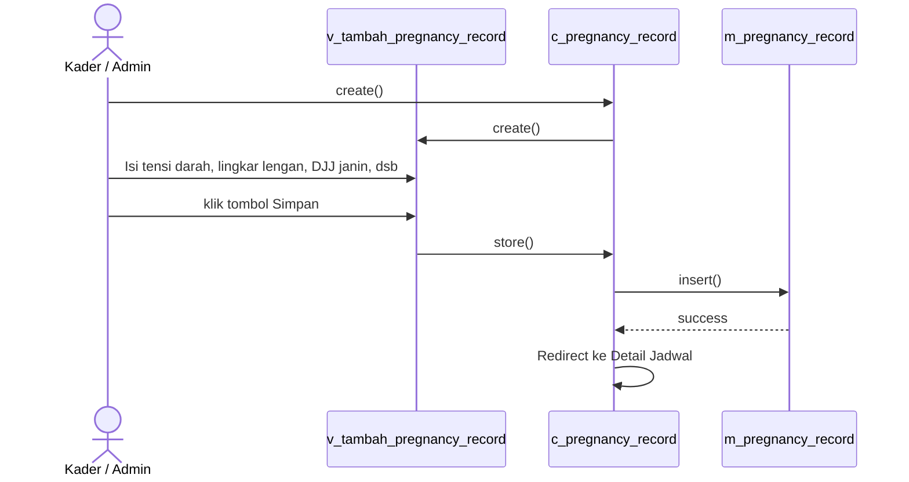

---

### J. Sequence Diagram Rekam Medis: Pencatatan Kesehatan Lansia
Menggambarkan alur pemeriksaan dan pencatatan kesehatan lansia saat kegiatan posyandu.

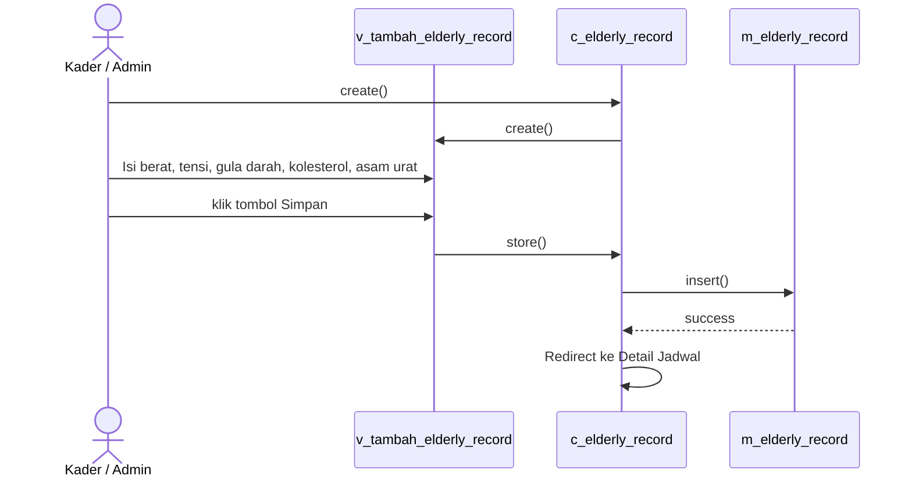
